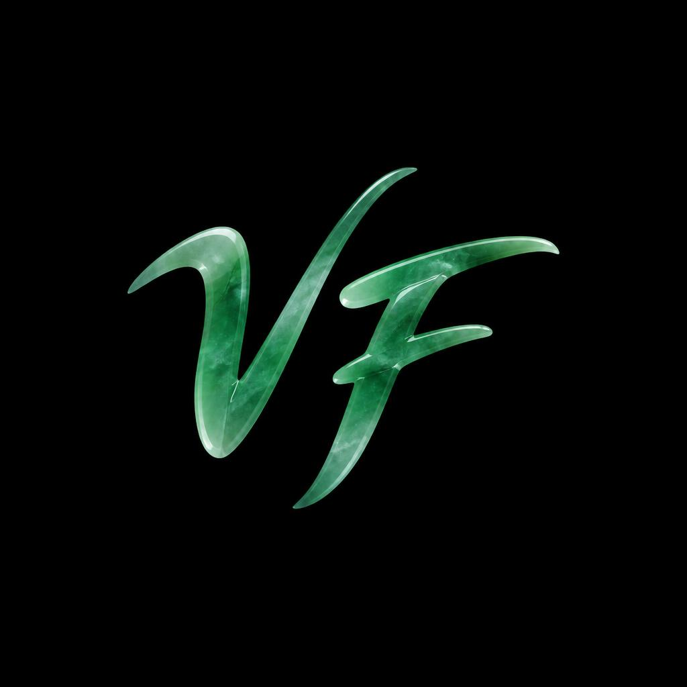
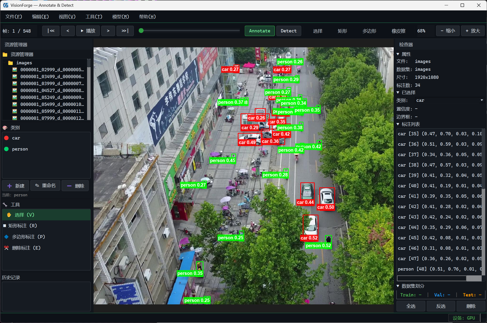
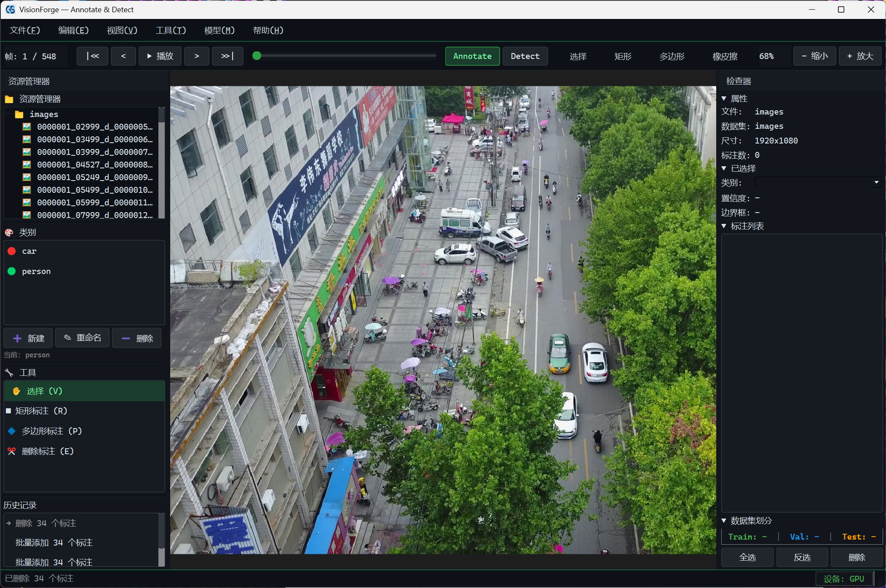

<div align="center">
  <p>
    <a href="https://github.com/ASH1b1/VisionForge/" target="_blank">
      </a>
  </p>

[简体中文](README.md) | [English](README_en.md)

</div>

<p align="center">
    <a href="./README.md"></a>
    <a href="./requirements.txt"></a>
    <a href="./README.md"></a>
    <a href="https://github.com/ASH1b1/VisionForge/issues"></a>
</p>

<p align="center">
  
</p>

## 🥳 最新动态

- `2026-09-19`: v3.1 核心能力设计完成：交互式 SAM 点选修正、自定义 Ultralytics YOLO 预标、YOLO-Pose / YOLO-OBB 导入导出、多边形顶点拖动编辑、统一 OpenMP 环境垫片。
- `2026-08-27`: 公众号连载《告别 LabelImg？这套 AI 标注工具安装只要一行命令》发布，提供 5 分钟上手指南。
- `2026-08-25`: 仓库结构升级为独立 VisionForge 产品仓。

## 简介

**VisionForge** 是一款面向 Windows 的桌面端 AI 辅助图像标注工具。它以「文本提示出框」为核心，把目标检测、实例分割、姿态估计、旋转框等数据制备流程整合进同一个界面，让算法工程师摆脱手动画框的重复劳动。

主要工作模式：

- **Annotate 模式**：用 GroundingDINO 按文本提示生成检测框，再按需调用 SAM3 生成精细多边形分割。
- **Detect 模式**：非破坏性地预览检测结果、调整置信度阈值，确认后再将结果转入标注工程。

VisionForge 适合需要快速构建或扩充 YOLO、COCO、VOC 等格式训练集的场景。

## 核心特性

<p align="center">
  
</p>

- **文本提示检测**：输入 `person, car` 等类别词，3 秒内得到带置信度的检测框。
- **SAM3 交互式分割**：框转多边形、正负点修正、Backspace 撤销单点、Enter 写回同一标注。
- **自定义 YOLO 预标**：加载用户导出的检测 ONNX（YOLOv8 / YOLO11 等默认 `yolo export format=onnx`），先走 Detect 预览，再转入标注。
- **多格式导入导出**：YOLO（检测 / 分割 / 姿态 / OBB）、COCO、VOC、LabelImg、PNG mask。
- **多边形顶点编辑**：闭合后的多边形可直接拖动顶点、双击边插入顶点、Delete 删除顶点。
- **工程文件 `.gsproj`**：相对路径、撤销栈、train/val/test 划分、schema v4 支持关键点元数据。
- **OpenMP 环境垫片**：统一处理 PyTorch 与 SAM3 重复加载 `libiomp5md.dll` 问题，避免 `OMP Error #15`。

## 支持的任务与格式

| 任务 | 说明 | 导入 | 导出 |
| :--- | :--- | :--- | :--- |
| 🎯 目标检测 | 轴对齐检测框（HBB） | YOLO、COCO、VOC、LabelImg | YOLO、COCO、VOC、LabelImg |
| 🖌️ 实例分割 | 多边形 / mask | YOLO-seg、COCO polygon、PNG mask | YOLO-seg、COCO polygon、PNG mask |
| 🏃 姿态估计 | 人体关键点 | YOLO-Pose、COCO keypoints | YOLO-Pose、COCO keypoints |
| 🔄 旋转目标检测 | 归一化四角 OBB | YOLO-OBB | YOLO-OBB |
| 👁️ 检测预览 | Detect 模式非破坏性预览 | — | Detect 结果导出 |

## 内置模型

| 能力 | 模型 | 说明 |
| :--- | :--- | :--- |
| 文本提示检测 | GroundingDINO | 默认检测器，按文本生成检测框 |
| 交互式分割 | SAM3 | 可选，支持框提示与正负点提示 |
| 自定义预标 | YOLO 检测 ONNX | 可选，加载用户导出的 `.onnx` 做封闭集预标 |

> 模型权重体积较大，未提交到 Git，请按下方「模型权重」说明手动放置。

## 文档

1. [快速开始](#快速开始)
2. [安装与模型权重](#安装与模型权重)

## 快速开始

### 环境要求

- Windows 10 / 11（x86_64）
- Git
- Anaconda 或 Miniconda
- 8GB 内存起步；GPU 推理需要兼容的 NVIDIA 驱动

### 安装

```powershell
git clone https://github.com/ASH1b1/VisionForge.git
cd VisionForge
conda create -n visionforge python=3.10 -y
conda activate visionforge
pip install -r requirements-cpu.txt
```

使用 NVIDIA GPU 时：

```powershell
pip install -r requirements-gpu.txt
```

### 模型权重

首次运行至少需下载 GroundingDINO 权重：

```powershell
mkdir models\grounding_dino
huggingface-cli download IDEA-Research/grounding-dino-base `
  --local-dir models\grounding_dino\models--IDEA-Research--grounding-dino-base `
  --include "*.safetensors" "*.json" "*.txt"
```

完整路径需为：

```text
models/grounding_dino/models--IDEA-Research--grounding-dino-base/snapshots/12bdfa3120f3e7ec7b434d90674b3396eccf88eb/model.safetensors
```

SAM3 权重按需放置，详见下方「未进入 GitHub 的模型文件」。

### 启动

```bat
启动.bat
```

或：

```powershell
conda run -n visionforge python src/main.py
```

### 第一张 AI 标注

1. 打开任意图片。
2. 在底部提示框输入 `person, car` 并回车。
3. 切换到 SAM3 工具，点击任意框进行分割修正。
4. 导出 → YOLO，即可获得 `.txt` 标签 + `data.yaml`。

### 自定义 YOLO 预标

在训练机导出检测 ONNX（标注机不必安装训练库）：

```text
yolo export model=best.pt format=onnx
```

将 `best.onnx` 与（如有）`data.yaml` 放在一起。VisionForge：**模型 → 加载自定义 YOLO → 选 .onnx**。

推理库按需安装（未写入 `requirements*.txt`）：

```powershell
pip install onnxruntime
# NVIDIA GPU 可用：pip install onnxruntime-gpu
```

只支持默认检测导出（图内无 NMS）。不要加 `nms=True`，也不要用姿态 / OBB ONNX 做预标。

## 未进入 GitHub 的模型文件

以下内容体积过大或来源独立，需手动下载并放到指定路径：

| 本机路径 | 大约大小 | 缺少时的影响 |
| :--- | :--- | :--- |
| `models/grounding_dino/models--IDEA-Research--grounding-dino-base/snapshots/12bdfa3120f3e7ec7b434d90674b3396eccf88eb/model.safetensors` | ~890 MB | 无法检测 |
| `models/sam3/sam3/sam3.pt` | ~3.3 GB | 无法使用 SAM3 分割 |

GroundingDINO 必须离线加载：`TRANSFORMERS_OFFLINE=1`，快照哈希已锁定。

## 参与贡献

欢迎提交 Issue 与 PR。所有新功能请按 Controller / Model / Exporter / Importer 拆分，禁止把逻辑堆进 `MainWindow`。提交前请确保测试通过：

```powershell
conda run -n visionforge python -m pytest src/tests/ -v --tb=short
```

如果这个项目对你有帮助，欢迎给它一颗 ⭐️！

## 许可协议

VisionForge 自有代码以 [Apache License 2.0](LICENSE) 授权。

本仓库是**混合许可**：

- 本仓库中由 VisionForge 原创的文件（含 `src/`）：[Apache License 2.0](LICENSE)，详见 [NOTICE](NOTICE)
- `sam3_src/`：Meta [SAM License](sam3_src/LICENSE)（非 OSI 标准许可）。再分发必须仍使用该许可并附带副本
- 其他第三方依赖保持其原许可，见 [NOTICE](NOTICE)

**SAM3 用途限制：** SAM License 禁止将 SAM 材料用于军事、战争、ITAR，或贸易管制禁止的最终用途。Apache 2.0 覆盖自有代码与 GroundingDINO 路径，不会取消上述限制。

提交代码须遵守 [Developer Certificate of Origin (DCO)](CONTRIBUTING.md)，commit 需包含 `Signed-off-by`。

## 致谢

感谢以下开源项目与社区为 VisionForge 提供的灵感与基础：

- [GroundingDINO](https://github.com/IDEA-Research/GroundingDINO)
- [Segment Anything Model 3 (SAM3)](https://github.com/facebookresearch/segment-anything-3)
- [Ultralytics YOLO](https://github.com/ultralytics/ultralytics)
- [LabelImg](https://github.com/tzutalin/labelImg)
- [LabelMe](https://github.com/wkentaro/labelme)
- [X-AnyLabeling](https://github.com/CVHub520/X-AnyLabeling)

## 关注我们

关注公众号 **Jade的工坊**，回复关键词 **VF**，获取访问入口、教程索引与读者交流群入口。

<p align="center">
  
</p>

<div align="center"><a href="#top">🔝 回到顶部</a></div>
